# Edge Delivery Services (EDS)

## Introduction

Edge Delivery Services (EDS) is a modern content delivery and web hosting platform that enables organizations to build, deploy, and deliver high-performance websites and applications at the edge. By leveraging a distributed network of servers, EDS brings content closer to end users, resulting in faster load times, improved reliability, and enhanced user experience.

## Key Features

- **Edge Computing**

  - Execute code and process requests at edge locations closest to users
  - Reduce latency and improve response times
  - Handle complex computations at the edge

- **Content Delivery Network (CDN)**

  - Distribute and cache content across a global network of servers
  - Automatic content replication and distribution
  - Smart routing and load balancing

- **Automated Deployments**

  - Streamline the deployment process with built-in CI/CD capabilities
  - Version control integration
  - Automated rollbacks and deployment monitoring

- **Performance Optimization**

  - Automatic asset optimization
  - Code minification and compression
  - Image optimization and lazy loading
  - Browser caching management

- **Security**

  - Built-in DDoS protection
  - SSL/TLS encryption
  - Web Application Firewall (WAF)
  - Access control and authentication

- **Scalability**
  - Automatically scale resources based on traffic demands
  - Load balancing across multiple regions
  - Traffic spike handling

## Benefits

1. **Improved Performance**

   - Reduced latency and faster page load times
   - Enhanced website performance and reliability
   - Better user experience across different regions

2. **SEO and Business Impact**

   - Improved SEO rankings through better performance metrics
   - Higher conversion rates
   - Reduced bounce rates

3. **Cost Optimization**

   - Lower origin server load
   - Reduced bandwidth costs
   - Efficient resource utilization

4. **Global Reach**
   - Global content distribution and delivery
   - Consistent performance worldwide
   - Regional compliance and data locality

## Limitations

### GitHub Dependency

Adobe Experience Developer Services (EDS) is primarily designed to work with GitHub, not GitLab. This is an important limitation to consider when working with this project.

### Key GitHub-Specific Dependencies

- Adobe I/O Gateway and Runtime services are tightly integrated with GitHub's authentication and webhook systems
- Adobe's official CI/CD pipelines and deployment workflows are built around GitHub Actions
- Adobe's documentation and official templates are all GitHub-focused

### Required GitHub Setup

To properly work with EDS, you must:

1. Create a GitHub repository instead of GitLab
2. Link your GitHub account with Adobe Developer Console
3. Use GitHub Actions for the CI/CD pipeline

### Alternative Solutions for GitLab Users

If you need to continue using GitLab, consider these options:

- Maintain a mirror repository on GitHub for Adobe EDS integration
- Use GitHub as the primary repository for Adobe EDS components while keeping other projects in GitLab

## Project Setup Guide

### Prerequisites

- GitHub account
- Repository access permissions
- AEM Code Sync GitHub App

### Step 1: Create Project from AEM Boilerplate

1. Navigate to the [AEM Boilerplate repository](https://github.com/adobe/aem-boilerplate)
2. Click on "Use this template" button
3. Choose "Create a new repository"
4. Fill in your repository details:
   - Owner: Your GitHub username or organization
   - Repository name: Your project name
   - Choose public or private visibility
5. Click "Create repository from template"

### Step 2: Configure AEM Code Sync

1. Go to your newly created repository
2. Navigate to the repository settings
3. Go to "GitHub Apps" section
4. Install the "AEM Code Sync GitHub App"
5. Configure the app permissions for your repository

### Step 3: Environment Setup

After setup, your project will be accessible at the following URLs:

```plaintext
Preview Environment:
https://main--{repo}--{owner}.aem.page/

Live Environment:
https://main--{repo}--{owner}.aem.live/
```

Replace:

- `{repo}` with your repository name
- `{owner}` with your GitHub username or organization name

### Step 4: Project Structure

```plaintext
project-root/
├── head.html           # Document head HTML
├── header.html         # Header HTML
├── footer.html         # Footer HTML
├── scripts/
│   ├── scripts.js      # JavaScript files
│   └── lib.js
├── styles/
│   └── styles.css      # CSS files
├── blocks/
│   └── block-library   # Reusable content blocks
├── tools/
│   └── sidekick/       # AEM Sidekick configuration
└── fstab.yaml          # Mount point configuration
```

## Google Drive Integration Guide

To use your Google Drive account with Adobe EDS, follow these steps:

### Step 1: Set Up Drive Folder


1. In Google Drive, create a folder with the same name as your repository.
2. Inside this folder, add the following files:

   - `nav.docs`
   - `footer.docs`
   - `index.docs` (acts as the main page)

   

### Step 2: Configure `fstab.yaml`


1. Add your Google Drive folder link to `fstab.yaml` in your project.
   

### Step 3: Share Folder with Adobe

1. Share the Google Drive folder with `helix@adobe.com` to grant Adobe access.
   

### Step 4: Preview with Adobe Sidekick

1. Install the Adobe Sidekick extension.
   
2. Open the shared Google Drive folder.
3. Select all files, then click "Preview" in Adobe Sidekick.
   
   Your project should be accessible via the following URLs:

- **Preview**: `https://main--{repo}--{owner}.aem.page/`
  
- **Live**: `https://main--{repo}--{owner}.aem.live/`
  
  

## Local development

1. Create a new repository based on the `aem-boilerplate` template and add a mountpoint in the `fstab.yaml`
1. Add the [AEM Code Sync GitHub App](https://github.com/apps/aem-code-sync) to the repository
1. Install the [AEM CLI](https://github.com/adobe/helix-cli): `npm install -g @adobe/aem-cli` (run cmd as administrator)
1. Start AEM Proxy: `aem up` (opens your browser at `http://localhost:3000`)
1. Open the `{repo}` directory in your favorite IDE and start coding :)

# Custom Block Creation in Adobe EDs

This guide will walk you through creating a custom block in Adobe Experience Designer (Adobe EDs). You’ll need to prepare a table in a Google Docs file and then work with CSS and JavaScript to style and implement your block.

## Steps

### 1. Prepare the Table in Google Docs

1. Open a new Google Docs document.
2. Create a table with **two columns**.
3. In the **first column**, provide the block names.
4. In the **second column**, include the details for each block.
5. Once the table is complete, preview the document to ensure accuracy.
   

### 2. Implement the Block Code

1. Navigate to the `blocks` folder within your project directory.
2. Create two new files in this folder:
   - A **CSS file** to style the custom block.
   - A **JavaScript (JS) file** to define the block’s functionality.
     
3. In the JS file, use the following starter code to handle the decoration of the block elements:

   ```javascript
   // Begin coding custom block functionality
   export default function decorate(block) {
     //code
     [...block.children].forEach((row, index) => {
       //code
       [...row.children].forEach((col) => {
         //code
       });
     });
   }
   ```

# Adding Section Metadata in EDS

# Adding Section Metadata in EDS Documentation

To include section metadata in your EDS documentation, you need to create a table with the heading **Section Metadata**. This table will consist of two columns: **Name** and **Value**, where you can define the metadata information.

---

## Steps to Add Section Metadata

1. Create a table with the title **Section Metadata** in your documentation.
2. Add two columns in the table:

   - **Name**: Represents the metadata key.
   - **Value**: Represents the corresponding metadata value.

3. Populate the table with the required metadata details.

---

## Example 1

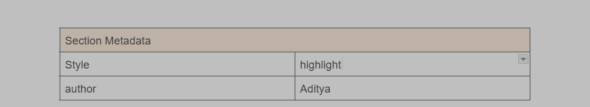

## Output

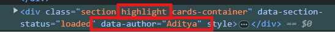

This format will help in organizing and maintaining metadata effectively in your EDS documentation.

# Adding Metadata to a Specific Page in EDS Documentation

To include metadata for a specific page in your EDS documentation, you need to create a table titled **Metadata** at the end of the page. This table will consist of two columns: **Name** and **Value**, where you can define the metadata information.

---

## Steps to Add Page-Specific Metadata

1. Navigate to the specific page in your EDS documentation.
2. At the end of the page, create a table with the title **Metadata**.
3. Add two columns in the table:

   - **Name**: Represents the metadata key.
   - **Value**: Represents the corresponding metadata value.

4. Populate the table with the required metadata details relevant to the page.

---

## Example

Here’s an example of how the table should look at the end of the page:
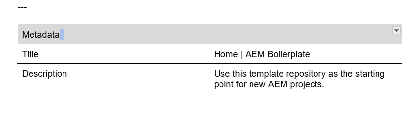

## Example Output

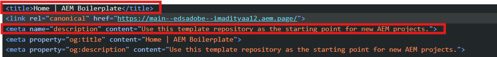

# Creating Routes in EDS Documentation

To create routes in EDS, you need to follow a specific folder and file structure. This ensures that the desired routes are generated correctly and can include custom navigation and footer files if needed.

---

## Steps to Create Routes

### 1. Create a Folder for the Route

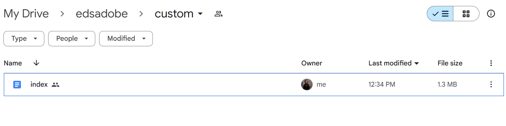

- Create a folder with the desired routing name.  
  For example, to create a route `/folder`, name the folder `folder`.

### 2. Add an `index` File

- Inside the folder, create a Google Docs file named `index`.
- This will generate the route `/folder`.

## Output

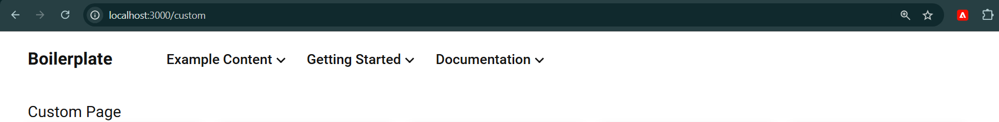

### 3. Add Additional Files

- If you create another Google Docs file with a different name in the same folder, the route will be `/folder/filename`.  
  For example:
  - A file named `about` inside `folder` will generate the route `/folder/about`.

---

## Adding Custom Navigation and Footer

### 1. Custom Navigation

- To include a custom navigation bar for the route, create a Google Docs file named `nav` inside the folder.

### 2. Custom Footer

- To include a custom footer, create a Google Docs file named `footer` inside the folder.

---

## Example Structure

Here’s an example directory structure for routes and associated files:

# Fetching Data from Sheets in EDS Documentation

This guide explains the process of retrieving data from sheets in your EDS documentation. It includes creating and linking a preview sheet and fetching data into a custom table using JavaScript and CSS.

---

## Steps to Fetch Data from Sheets

### 1. **Create and Preview a Sheet**

- Create a sheet in your EDS workspace and add the required data.
  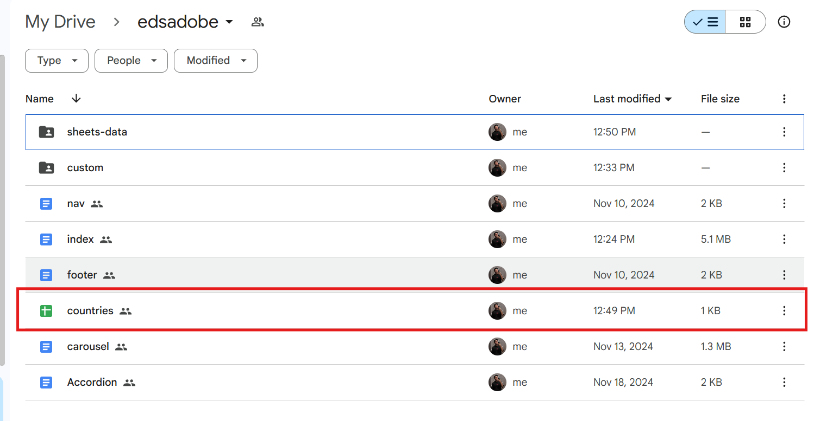
- Click on the **Preview** option to generate the sheet's preview URL.

## Preview

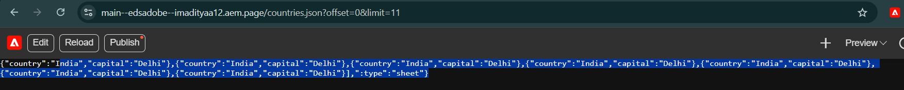
Example preview URL:  
 `https://main--edsadobe--imadityaa12.aem.page/countries.json?offset=0&limit=11`

### 2. **Link the Sheet in a Doc File**

- Create a Google Docs file where you want to link the sheet.
  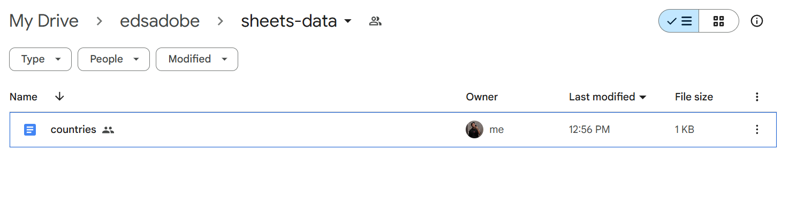
- In the doc file, create a table and add the preview URL of the sheet in the table.
  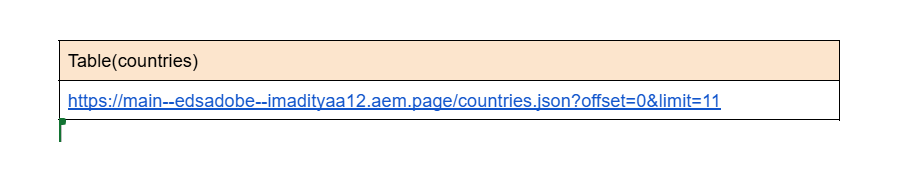

### 3. **Preview the Document**

- Preview the document to ensure the sheet link is correctly displayed and functional.

---

## Steps to Fetch Data into a Table

### 1. **Create Required Files**

- Inside the `block` folder of your project, create the following files:
  - `table.js`: For fetching and displaying data.
  - `table.css`: For styling the table.
    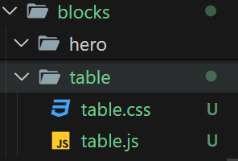

### 2. **Fetch Data from URL**

- Use the preview URL from the sheet to fetch data dynamically in the `table.js` file.

---

## Example Code

### `table.js`

```javascript
const fetchData = async () => {
  const url = "https://example.com";
  try {
    const response = await fetch(url);
    const data = await response.json();
    renderTable(data);
  } catch (error) {
    console.error("Error fetching data:", error);
  }
};

const renderTable = (data) => {
  //code
};
```
